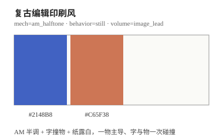
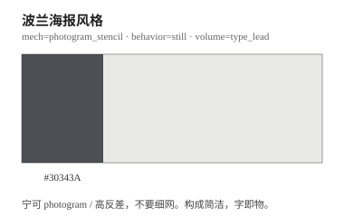
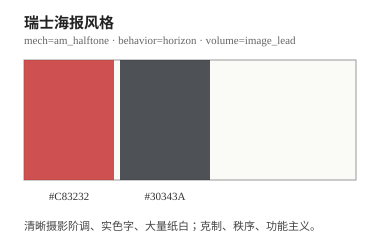
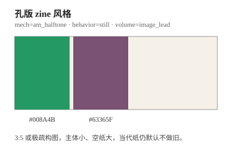
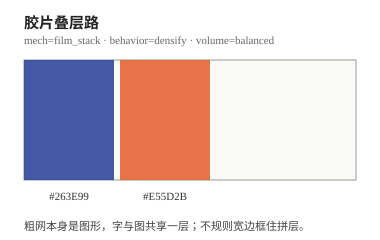
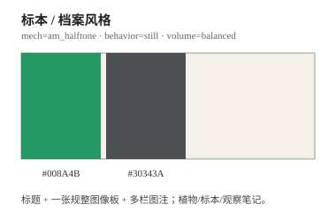

<div align="center">

# taxue-halftone · 半调海报

**你说想做个有印刷质感的封面，它写成模型能听懂的指令。**

[](./CHANGELOG.md)
[](./SKILL.md)
[](https://github.com/taxueseek/taxue-halftone/stargazers)
[](https://github.com/taxueseek/taxue-halftone/actions/workflows/validate.yml)
[](./SKILL.md)

</div>

要一张「像印出来的」海报或封面，不用 PS 滤镜糊弄。它按印刷品的规矩来：最多两支墨，纸是画面的一部分，颜色都有来处，字和图分清主次。规矩定死了，做出来张张能复现，不靠撞运气。

怎么判断是不是这张海报：做完指得出「这块颜色是哪支墨、这个角是几度、纸从哪儿露出来」。指不出来，就不算。

## 示例作品

> 图集待补充：图片放 `examples/` 目录，由技能实际出图后挂进来（版权见 [ASSET-LICENSE.md](./ASSET-LICENSE.md)）。

| 待补充 | 待补充 | 待补充 |
|:---:|:---:|:---:|
| 示例图 1 | 示例图 2 | 示例图 3 |

## 它只干这一件事

把一句话、一个主题或一张照片，做成一张限墨印刷风的海报或封面。

- **按风格出图**　「用半调做一张凌晨便利店的竖版海报，标题写 still open」
- **改已有想法**　「给我这个主题配个孔版 Riso 的封面」
- **一套到底**　出图之外，把配色、版式、印刷工艺、字和图的分工都讲清楚，想改哪块直接说

默认两色：一支主墨管七八成，一支辅墨只干一件具体的事。想只上一支墨也行，说一声就切。

## 出图前先定六件事

不管哪个风格，动手前这六件事都得有明确答案，缺一件图就说不清来源：

1. **纸是什么色**　纸是底色，不算墨。想在深底上出白字，边要单独处理。
2. **几支墨、各干嘛**　一支主墨管主体和标题，一支辅墨只做一件事（写日期、标注释、勾一个物件）。第二支墨不是撒着玩的。
3. **两色相遇怎么办**　叠上去、抠掉、还是留一条套准边，三选一。
4. **什么印刷工艺**　半调网点、剪影、高反差、胶片叠层、复印机，一次用一种。
5. **主体往哪走**　静止陈列、向外散开、向内聚拢、沿地平线、顺着长边消失，选一个。
6. **字和图谁大声**　字大声图就退，图大声字就退，不许两个都抢。

## 六套风格

选一个，剩下按上面六件事的规矩来：

| 风格 | 色票 | 一句话人话版 | 常用平台 |
|---|---|---|---|
| **editorial** 当代编辑 |  | 蓝 + 陶土橙，半调网点，一物占大头、字从图上压过去。最常用的基准款 | 小红书 3:4、B站 16:9、公众号 |
| **polish** 波兰海报 |  | 只上一支墨，高反差剪影，字本身就是画面，干净利落 | B站 16:9、超宽 5:2 |
| **swiss** 瑞士海报 |  | 红 + 黑，照片阶调清楚、字用实色、纸白大片，克制规矩 | B站 16:9、公众号、超宽 5:2 |
| **riso_zine** 孔版小册子 |  | 绿 + 紫，主体小、纸留大片白，像手工印的小册子 | 小红书 3:4、头像 1:1 |
| **filmstack** 胶片叠层 |  | 蓝 + 橙，粗网点本身就是图形，宽边框住几层叠片 | B站 16:9、公众号 |
| **archival** 标本档案 |  | 绿 + 黑，标题加一张规整图版加多栏注文，像标本观察笔记 | 小红书 3:4、公众号 |

颜色有来处：纸是底色不算第三色，两色叠出来的深色不算第三支墨，浅一档的墨只是主墨变淡，也不算新颜色。辅墨必须有事干，不许洒满页当装饰。

## 适合做什么

- 海报：活动、展览、城市漫游、概念海报
- 平台封面：小红书、公众号、播客、B站、头像、超宽头图
- 品牌物料：明信片、邀请函、门票、菜单、包装贴纸
- 书刊：封面、扉页、章节页、zine 内页
- 纪念物：旅行手账、相册封面、周年卡
- 文字：文学摘句、诗歌、个人宣言

想直接做「半调、孔版、双色、Riso、木刻、蓝晒、复印机」那种质感，说用途就行，它配好再出图。

## 不做什么

- 不是全彩照片套个单色滤镜
- 不是两种颜色随便撒，更不是超过两支墨
- 不是光滑样机、3D 渲染、渐变海报、电影截图
- 不是居中模板、卡片拼贴、装饰色块
- 不是一用网点就自动泛黄做旧、强行怀旧
- 不是营销文案、虚构品牌、假赞助、二维码
- 不是照着别人的海报或艺术家签名复刻
- 不是把 Riso（印刷机）和半调（加网）当成能随便替换的两个滤镜

## 怎么工作

```text
1  先说清楚要什么   →  主体、用途、文案、字和图的角色
2  定六件事         →  纸色、墨、相遇方式、工艺、走向、字图主次
3  排版             →  一物占大头，字撞上去，纸切进图，留一个手工小动作
4  写提示词         →  编成模型能直接执行的完整指令
5  出图前查一遍     →  六件事是不是都定齐了
6  出图后对一遍     →  颜色来源、主体认得出、没有乱码，只改一次只改一项
```

## 开始使用

```bash
npx skills add taxueseek/taxue-halftone
```

装好后直接说上面任何一句，或输入 `/taxue-halftone`。

## 改了什么会有人盯着

「规矩」不是写进文档就算数：六件事各有一份机器能读的清单，六套风格是这些清单的组合，还配了评测用例。改任何一个地方，跑一遍检查就知道有没有改坏。

```bash
scripts/run_tests.sh                      # 一次跑完：清单结构 + 风格是否定齐 + 评测断言
scripts/validate_styles.py <style_id>     # 单独查某个风格六件事有没有定齐
scripts/render_style_card.py <style_id>   # 重新生成上面的色票图
```

push 和提 PR 会自动跑一遍（GitHub Actions），坏了直接标红。

## 更新记录

- **v1.0.0**（2026-09-01）：第一次发布。六件事定规矩 + 六套风格 + 机器检查 + 六个评测用例。详见 [CHANGELOG.md](./CHANGELOG.md)。

## License

代码和技能内容走 [MIT License](./LICENSE)；`examples/` 里的示例图走 [ASSET-LICENSE.md](./ASSET-LICENSE.md)，不随 MIT 分发。