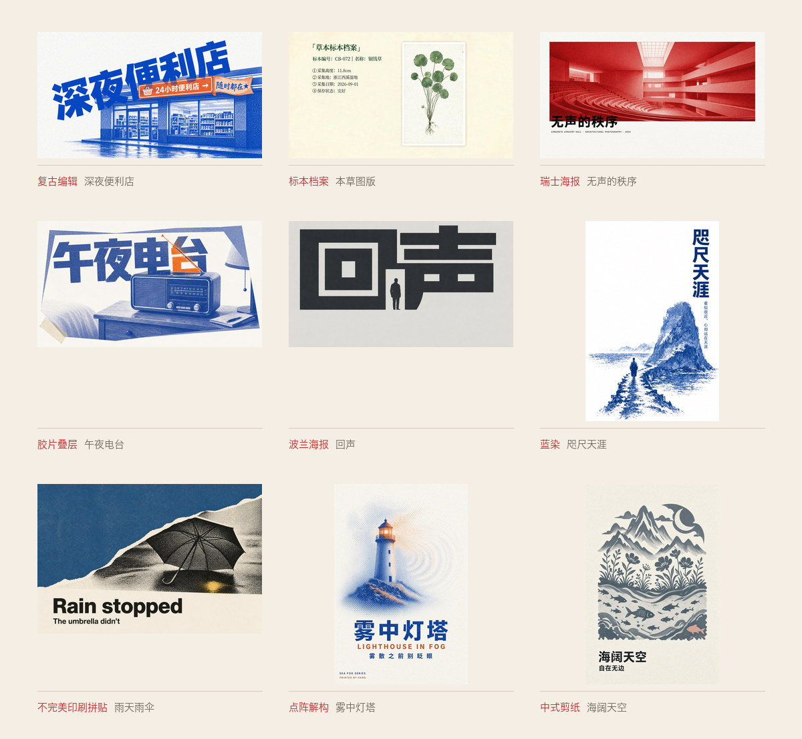
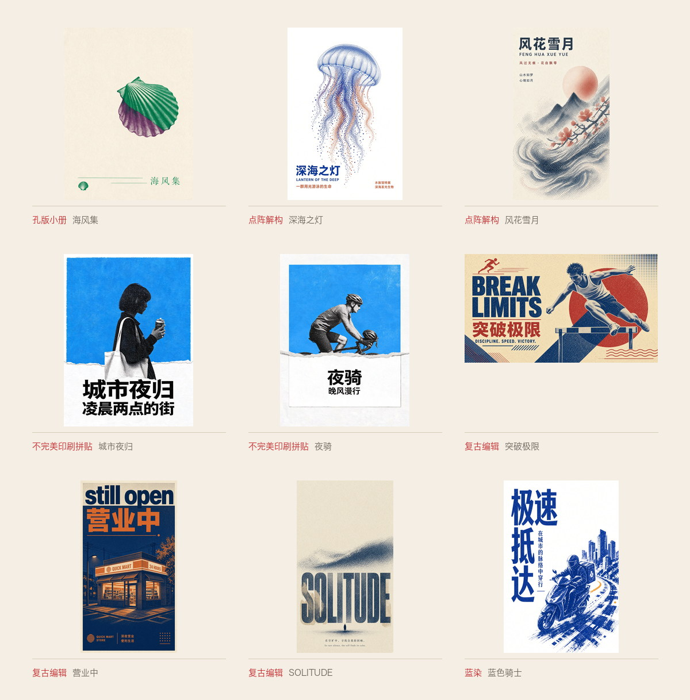
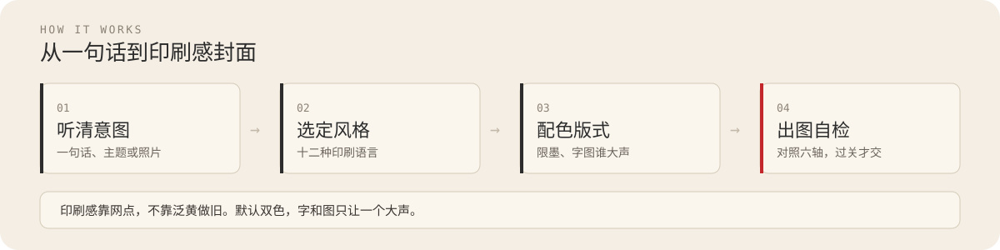

<p align="center">


</p>

<p align="center">
  <a href="./README.en.md">English</a> ·
  <a href="#成图标本">成图</a> ·
  <a href="#十二种风格--两个变体">风格</a> ·
  <a href="#怎么工作">怎么工作</a> ·
  <a href="#开始使用">开始使用</a>
</p>

# 踏雪半调海报

把一句话、一个主题或一张照片，做成一张有印刷质感的封面。

## 生图技能家族

同属踏雪生图系列，先认门，再用对技能：

| 技能 | 一句话 | 仓库 |
|---|---|---|
| **踏雪创意风格**（影像风格引擎） | 14 个家族、77 个变体：按风格出图、改提示词、从零写、记住偏好 | [taxue-creative-style](https://github.com/taxueseek/taxue-creative-style) |
| **半调海报**（印刷质感引擎） | 12 种风格 + 2 个变体：一句话、一个主题或一张照片，做成印刷感封面 | **你在这里** · [taxue-halftone](https://github.com/taxueseek/taxue-halftone) |
| **节气拍立得**（节气创作引擎） | 节气、节日、物候短句，推出有记忆点的海报、纸本档案与拍立得 | [taxue-solar-polaroid](https://github.com/taxueseek/taxue-solar-polaroid) |
| **踏雪生图**（元提示词库） | 四种类型 + 四种工作流 + 机械填槽 + 一次验收 | WorkBuddy 专属 · [taxue-imagegen](https://github.com/taxueseek/taxue-imagegen) |

它做的是「印刷感」的图：半调网点、Riso 孔版、木刻、蓝晒、复印机那种质感。默认双色（一主一辅），也可以只用单色。配色、字放哪，它会配好，最后给你一份完整可复用的提示词。

## 成图标本

十种风格各有样张。点题名看原图。



<p align="center">
<a href="./examples/example-midnight-store.jpg">深夜便利店</a> ·
<a href="./examples/example-herbarium.png">标本档案</a> ·
<a href="./examples/example-concert-hall.jpg">无声的秩序</a> ·
<a href="./examples/example-midnight-radio.png">午夜电台</a> ·
<a href="./examples/example-echo.png">回声</a> ·
<a href="./examples/example-aizome-near-far.jpg">咫尺天涯</a> ·
<a href="./examples/example-rain-umbrella.png">雨天雨伞</a> ·
<a href="./examples/example-dot-dissolve-lighthouse.jpg">雾中灯塔</a> ·
<a href="./examples/example-paper-cut-group-sea-sky.jpg">海阔天空</a>
</p>

同一套印刷语言，还可以长成这些样子。



<p align="center">
<a href="./examples/example-seashell.png">海风集</a> ·
<a href="./examples/example-dot-dissolve-jellyfish.jpg">深海之灯</a> ·
<a href="./examples/example-dot-dissolve-fenghuaxueyue.jpg">风花雪月</a> ·
<a href="./examples/example-night-walk.png">城市夜归</a> ·
<a href="./examples/example-night-ride.png">夜骑</a> ·
<a href="./examples/example-break-limits.jpg">突破极限</a> ·
<a href="./examples/example-still-open.jpg">营业中</a> ·
<a href="./examples/example-solitude.jpg">SOLITUDE</a> ·
<a href="./examples/example-aizome-blue-knight.jpg">蓝色骑士</a> ·
<a href="./examples/example-last-kilometer.jpg">最后一公里</a> ·
<a href="./examples/README.md">全部原图</a>
</p>

> 图片放在 `examples/` 目录，由技能实际出图产出（版权见 [ASSET-LICENSE.md](./ASSET-LICENSE.md)）。十二种风格与两个变体中十个有示例图：不完美印刷拼贴与点阵解构各有三张，复古编辑五张（含双语变体两张），蓝染两张，其余风格各一张；经典致敬、波普波点与两种变体（点阵剪纸、物影蓝晒）暂无样张。

## 十二种风格 + 两个变体

| 风格 | 色卡 | 特点 |
|---|---|---|
| **复古编辑**（editorial） |  | 蓝 + 陶土橙，半调网点，一个主体占大头、文字压上去，旧杂志编辑排版的复古感，最常用，内置精炼元提示词模板（只输入主题即可出图） |
| **波兰海报**（polish） |  | 单色高反差，字本身就是画面，干净利落 |
| **瑞士海报**（swiss） |  | 红 + 黑，照片阶调清楚、实色大字、留白多，克制规矩 |
| **孔版小册**（riso_zine） |  | 绿 + 紫，主体小、纸留大片白，像手工印的小册子 |
| **胶片叠层**（filmstack） |  | 蓝 + 橙，粗网点本身就是图形，几层叠片、宽边框住 |
| **标本档案**（archival） |  | 绿 + 黑，标题 + 一张规整图版 + 多栏注文，像标本观察笔记 |
| **不完美印刷拼贴**（imperfect_collage） |  | 暖白纸 + 大面积专色场 + 黑白半调主体，撕纸边揭示，上图下卡，有意的不完美 |
| **点阵解构**（dot_dissolve） |  | 紫 + 红，复古丝网圆点阵，主体从具象解构成点阵、颗粒和波纹，粗体字融进点阵场，内置元提示词模板（只输入主题即可出图） |
| **中式剪纸**（paper_cut_group） |  | 墨黑 + 朱红，剪纸剪影层层交错，细节靠白色负空间镂空，一枚跳色例外成员，上图下卡，内置元提示词模板（只输入主题即可出图） |
| **点阵剪纸**（paper_cut_halftone，变体） |  | 主色 + 纸色 + 克制跳色，点阵解构与中式剪纸的混搭——剪纸窗花轮廓配粗圆网点铺形，暗部不断网，用色倾向三选一，上图下卡，内置元提示词模板（主题唯一必填） |
| **蓝染**（aizome） |  | 绝对纯白数字平面 + 深靛蓝 + 钴蓝，蓝晒式平阶剪影，染液浓淡与版画排线只在蓝色内部，主标题副标题随九方位变奏，内置元提示词模板（只输入主题即可出图） |
| **物影蓝晒**（aizome_photogram，变体） |  | 反俗套蓝染：蓝底白形的蓝晒物影，现代潮流物件（滑板/耳机/球鞋）平放曝光留白，水洗晕染只在蓝区，展柜气质，内置元提示词模板（物件必填） |
| **经典致敬**（tribute） |  | 任意名画/艺术流派/年代美学为母题，巨大粗体英文标题 × 极小形象的纪念碑式反差，抽象转译不复刻可辨认画面，中文为主英文呼应，内置元提示词模板（风格来源 + 主题必填） |
| **波普波点**（polka） |  | 同一种视觉单元（实心圆点/细弧网/镜面延展）全幅连续生成，单元吞没主体、无中心无焦点，≤3 色 HEX、丙烯珐琅平涂，内置精炼元提示词模板（主体必填，机制三选一，附 6 条自检清单） |

想用哪个风格，直接点名；不说风格它会按主题和用途选。

## 怎么工作

<p align="center">
  
</p>

输入是你的意图，输出是能直接出图的提示词。图好不好，取决于四件事：有没有听清你要什么、风格选得对不对、墨色和字图音量有没有锁死、出图后有没有对照六轴检查。

## 开始使用

```bash
npx skills add taxueseek/taxue-halftone
```

装好后直接说，例如：

- 「用半调做一张凌晨便利店的竖版海报，标题写 still open」
- 「把这张照片做成孔版 Riso 封面，标题是『深夜电台』」
- 「做一个单色高反差剪影海报，主题是孤独，不要文字」

也可以输入 `/taxue-halftone` 触发。每次会给你三样东西：一张图（有生图工具时）、一份完整提示词、一份配色和版式的说明。不满意就指出来，它一次只改一处。

## 适合做什么

- 海报：活动、展览、城市漫游、概念海报
- 平台封面：小红书、公众号、播客、B站、头像、超宽头图
- 品牌物料：明信片、邀请函、门票、菜单、包装贴纸
- 书刊：封面、扉页、章节页、zine 内页
- 纪念物：旅行手账、相册封面、周年卡
- 文字：文学摘句、诗歌、个人宣言

## 基本规矩

- **配色讲纪律**：默认限墨双色——主色管主体和标题，辅色只做一件事（日期、注释、勾一个物件），不洒满页当装饰；色彩丰富的风格（经典致敬、波普波点）按各自族规执行：每色有职务、主次分明、禁止平均分配
- **纸是画面的一部分**：底色不算颜色，浅色纸配深色、深纸配浅字都算好
- **字和图分主次**：字大声图就退，图大声字就退，不两个都抢
- **印刷感靠网点不靠做旧**：用半调、Riso 不等于要泛黄、怀旧

## 随机性与创造力

半调风格的精髓在艺术那一面，自带随机性与创造力。作为一个 Design Skill，它特意没有做僵化的约束，也不追求复刻一个固定的效果：同一段提示词交给 GPT Image 2、Grok Imagine 2、Nano Banana 2、Seedream 5.0 Pro，出图的风格有时候会有较大的不同。这是有意保留的创作空间——同一句话多跑几次，常能撞出不同的好图，挑一张最对的用。

选模型的经验（个人建议）：

- **主力创作**：GPT Image 2、Grok Imagine 2
- **后备**：Nano Banana 2、Seedream 5.0 Pro

## 工程校验

规范不只写在文档里：十二种风格与变体的取值、配色、机制都有机器可读的清单，配有评测用例。改任何一处，跑一遍检查就能发现有没有改坏，push 或提 PR 时 GitHub Actions 会自动跑。

```bash
scripts/run_tests.sh                    # 一次跑完所有检查
scripts/validate_styles.py <style_id>   # 单独查某个风格
scripts/render_style_card.py <style_id> # 重新生成色卡图
```

## 更新记录

- **v1.4.2**（2026-09-05）：风格名统一为「XX风格」；波普波点与物影蓝晒进入发布线。详见 [CHANGELOG.md](./CHANGELOG.md)。
- **v1.4.1**（2026-09-04）：示例图集扩充六张实测样张，并剥离生成元数据。
- **v1.4.0**（2026-09-04）：文案标点硬约束落地；新增蓝染与经典致敬。详见 [CHANGELOG.md](./CHANGELOG.md)。
- **v1.3.0**（2026-09-03）：参考创作模式。详见 [CHANGELOG.md](./CHANGELOG.md)。
- **v1.2.0**（2026-09-03）：图源输入诊断、四域命题、中文展示字形速查。详见 [CHANGELOG.md](./CHANGELOG.md)。
- **v1.1.0**（2026-09-03）：新增不完美印刷拼贴、点阵解构、中式剪纸与点阵剪纸变体。详见 [CHANGELOG.md](./CHANGELOG.md)。
- **v1.0.0**（2026-09-01）：首次发布。六种风格、六种印刷质感、机器校验和评测用例。详见 [CHANGELOG.md](./CHANGELOG.md)。

## License

代码和技能内容走 [MIT License](./LICENSE)；`examples/` 里的示例图与 `assets/readme/` 头图、成图墙走 [ASSET-LICENSE.md](./ASSET-LICENSE.md)，不随 MIT 分发。
